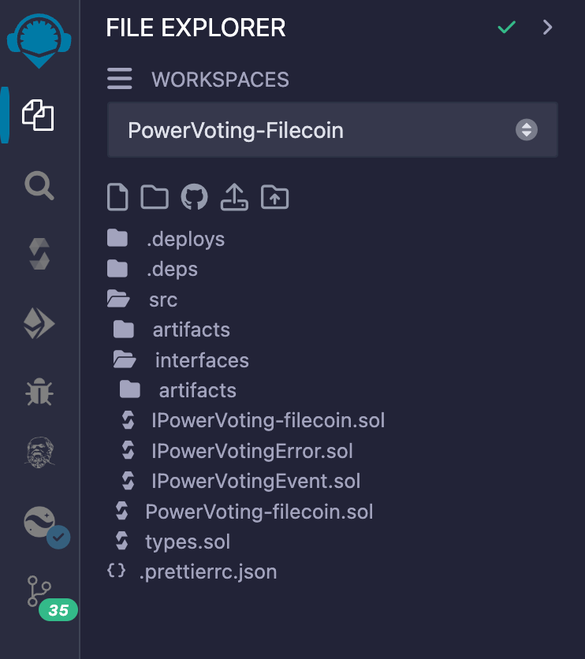
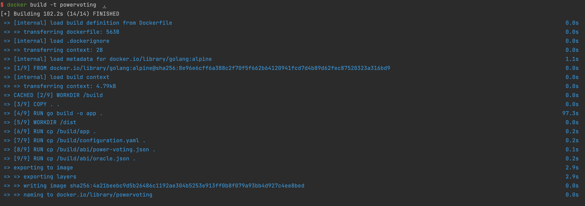
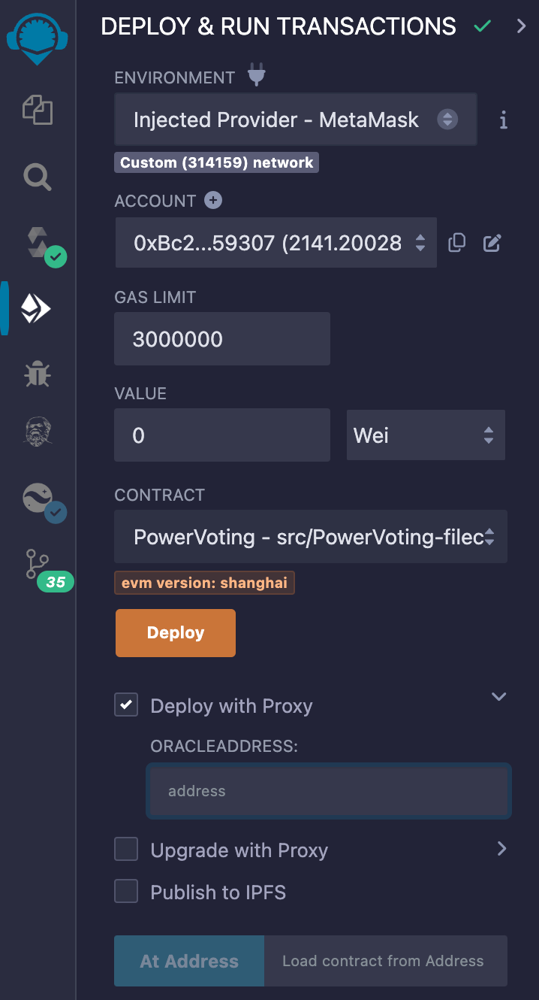
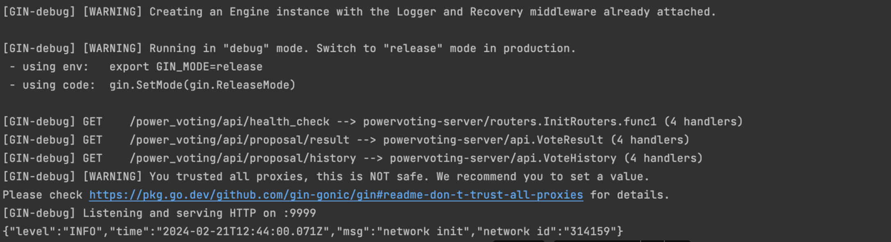

# I.Compilation of the Oracle node

## 1.First, you need to install the Go toolchain. You can find [instructions](https://go.dev/doc/install) here, with Go version >= 1.20

## 2.Install [Docker](https://docs.docker.com/engine/install/ubuntu/)

## 3.Obtain the code for the Oracle node, with the repository branch set to: filecoin

```bash
git clone https://gitlab.com/storswiftlabs/wh/dapp/power-voting/kyc-oracle.git
```

## 4.Switch branch and enter the backend directory

```bash
git checkout filecoin
cd backend
```

## 5.Modify the configuration.yaml configuration file



## 6.Build Docker image

```bash
docker build -t oracle  .
```




## 7.Run Docker image

```bash
docker run -d oracle
```




## 8.View logs

```bash
docker logs -f f3b24890eff07a89d7c27c92164b80983a7a12e81692e72db9a8747631aa2230
```


