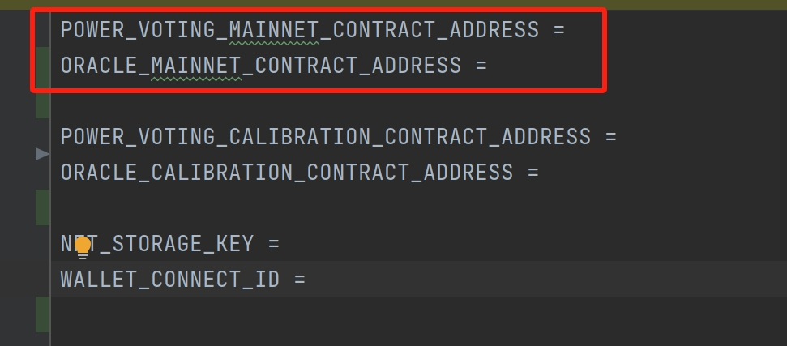
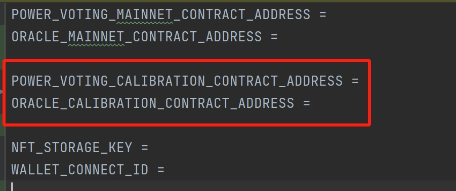
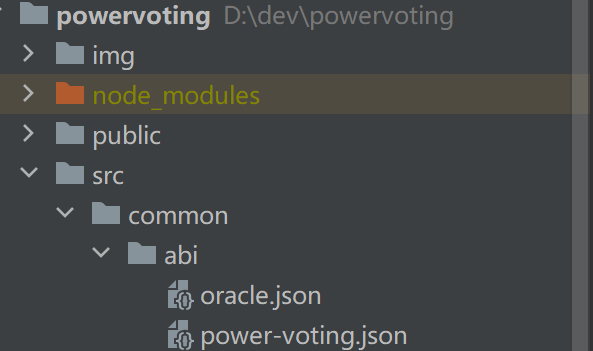
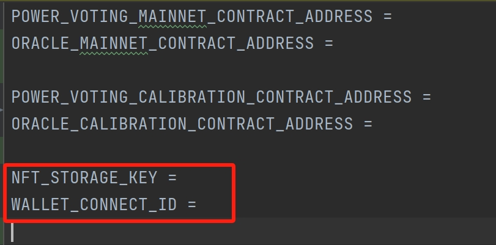
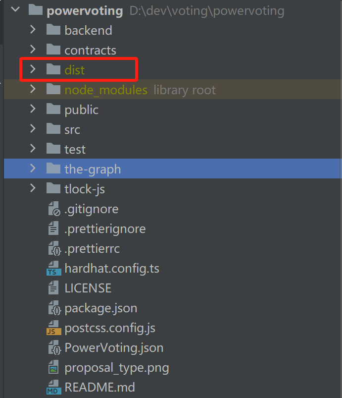

## Power Voting Front-end Compilation Process

### 1.Environment and Development Tools

1.Node.js 14 or later installed

2.npm 7 or later installed

3.Yarn  v1 or v2 installed

4.Git


### 2.Download Source Code

Download the source code with the following command:

```
git clone https://github.com/storswiftlabs/powervoting.git
```

### 3.Install Dependencies

Install dependencies with the following command:

```
yarn
```

After yarn, you will get a 'node_modules' folder in the root directory.


### 4.Update Smart Contract Address And ABI

Deploying PowerVoting and Oracle contract on Filecoin main network and replace the following address in ‘/src/common/consts.ts’



If you deploy the contract on Filecoin test network Calibration, you should replace the following address in ‘/src/common/consts.ts’



If you modify the contract code, you need to update the following abi in ‘/src/common/abi’




### 5. Update IPFS Storage Key And Wallet Connect Project Id

Create NFT storage key by https://nft.storage/manage/

Create wallet connect project id by https://www.rainbowkit.com/docs/migration-guide#012x-breaking-changes

Replace the following keys in ‘/src/common/consts.ts’




### 6.Build And Package

Build  with the following command:

```
yarn build
```

After building, you will get a 'dist' folder in the root directory.



### 7.Deployment

To deploy the 'dist ' folder generated after building your front-end project, you can follow these steps:

1. **Upload the dist folder to the server**: Upload the `dist` folder to your server. You can use FTP tools, SSH, or other methods to transfer the files to a specific directory on your server.
2. **Configure the Web Server**: Ensure that your web server (such as Nginx, Apache, etc.) is properly configured, and you know where to serve static files from. Add a new site or virtual host in the configuration file and set the document root to point to the uploaded `dist` folder.
3. **Start the Web Server**: Start or restart your web server to apply the new configuration.
4. **Access the Website**: Open your browser and enter your domain name or server IP address. You should be able to see your deployed front-end application.


