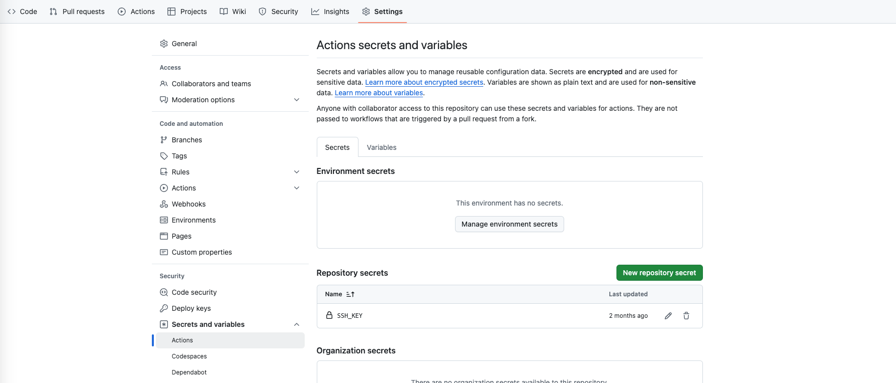
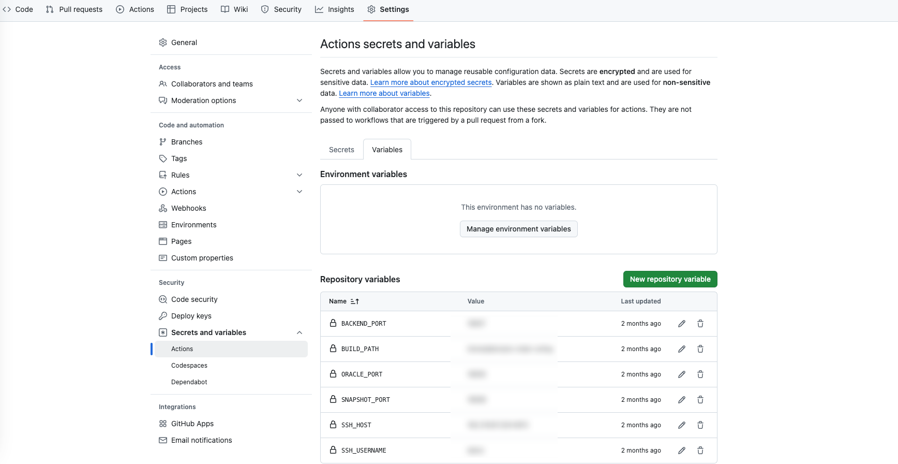

# GitHub CD Deployment Documentation

## 1. Configure GitHub Repository Variables

### 1.1 Configure SSH Key

When deploying with GitHub Actions, an SSH connection to the server is required for security. Configure the SSH key in the GitHub repository under **"Settings" > "Secrets and variables" > "Actions"**.



### 1.2 Configure Environment Variables

Add the following environment variables under **"Settings" > "Secrets and variables" > "Actions" > "Variables"**:

- `BACKEND_PORT`: Backend service port
- `BUILD_PATH`: Project path
- `SNAPSHOT_PORT`: Snapshot service port
- `SSH_HOST`: Host IP
- `SSH_USERNAME`: Username



## 2. Install Docker

Follow the [official documentation](https://docs.docker.com/engine/install/) to install Docker.

## 3. Clone the Repository

```
git clone https://github.com/filecoin-project/on-chain-voting
```

## 4. Start the snapshot-redis, snapshot-nats, and MySQL services

### 4.1. Modify the `docker-compose.yml` File

```
cd on-chain-voting 
vim docker-compose.yml
```

```sh
version: '3.3'

services:
  snapshot-redis:
    image: redis:latest
    ports:
      - "16379:6379"
    volumes:
      - <REDIS_DB_PATH>:/data
    command: redis-server --appendonly yes
    deploy:
      resources:
        limits:
          memory: 50G

  snapshot-nats:
    image: nats:latest
    ports:
      - "14222:4222"
      - "18222:8222"
    volumes:
      - <NATS_DB_PATH>:/data
    command: [ "-js", "-store_dir", "/data", "-m","8222"]
    deploy:
      resources:
        limits:
          memory: 50G

  mysql:
    image: mysql:latest
    restart: always
    environment:
      MYSQL_ROOT_PASSWORD: <ROOT_PASSWORD>
    ports:
      - "13306:3306"
    volumes:
      - <MYSQL_DB_PATH>:/var/lib/mysql
```

### 4.2 Start Docker

```
docker compose up -d
```

### 4.3 Connect to the Database

 Create a Database Named `power-voting-filecoin`

## 5. Project Configuration

### 5.1 Frontend Configuration

#### 1. Navigate to the Frontend Directory

```
cd power-voting
```

#### 2. Configure Environment Variables

```
mv .env.example .env
vim .env
```

Example configuration:

```
POWER_VOTING_MAINNET_CONTRACT_ADDRESS=<mainnet_contract_address>
POWER_VOTING_CALIBRATION_CONTRACT_ADDRESS=<calibration_contract_address>

ORACLE_MAINNET_CONTRACT_ADDRESS=<mainnet_oracle_contract_address>
ORACLE_CALIBRATION_CONTRACT_ADDRESS=<calibration_oracle_contract_address>

ORACLE_POWER_MAINNET_CONTRACT_ADDRESS=<mainnet_oracle_power_contract_address>
ORACLE_POWER_CALIBRATION_CONTRACT_ADDRESS=<calibration_oracle_power_contract_address>

WALLET_CONNECT_ID=43a5e091da6b7d42e521c6cce175bc94 
```

#### 3. Configure Nginx

```
mv nginx.conf.example nginx.conf
vim nginx.conf
```

Example configuration:

```
server {
    root /voting/dev/dist;
    index index.html index.htm index.nginx-debian.html;
    access_log /voting/access.log;

    location / {
        try_files $uri /index.html;
    }

    location /api {
        proxy_set_header X-Real-IP $remote_addr;
        proxy_set_header Host $host;
        proxy_set_header X-Forwarded-For $proxy_add_x_forwarded_for;
        proxy_pass { BACKEND_HOST }/power_voting/api;
    }

    location /rpc/v1 {
        proxy_set_header X-Real-IP $remote_addr;
        proxy_set_header Host $host;
        proxy_set_header X-Forwarded-For $proxy_add_x_forwarded_for;
        proxy_pass { RPC_HOST };
        add_header Access-Control-Allow-Origin *;
        add_header Access-Control-Allow-Methods "GET, POST, OPTIONS, PUT";
        add_header Access-Control-Allow-Headers "Origin, X-Requested-With, Content-Type, Accept";
        proxy_hide_header Content-Type;
        add_header Content-Type application/json;

        if ($request_method = 'OPTIONS') {
            return 204;
        }
    }

    listen [::]:{ LISTEN_PORT } ipv6only=on;
    listen { LISTEN_PORT };
}
```

### 5.2 Backend Configuration

#### 1. Navigate to the Backend Directory

```
cd powervoting-backend
```

#### 2. Modify the Configuration File

```
mv configuration.yaml.example configuration.yaml
vim configuration.yaml
```

Example configuration:

```
server:
  port: :<PORT>

snapshot:
  rpc: <SNAPSHOT_IP>:<PORT>

drand:
  url:
    - "https://api.drand.secureweb3.com:6875"
    - "https://api.drand.sh/"
    - "https://api2.drand.sh/"
    - "https://api3.drand.sh/"
    - "https://drand.cloudflare.com/"
  chainHash: "52db9ba70e0cc0f6eaf7803dd07447a1f5477735fd3f661792ba94600c84e971"

mysql:
  url: <MYSQL_IP>:<POST>
  username: root
  password: <MYSQL_ROOT_PASSWORD>

network:
  - id: <CHAIN_ID>
    name: <CHAIN_NAME>
    rpc: <CHAIN_RPC>
    powerVotingAbi: /dist/power-voting.json
    oracleAbi: /dist/oracle.json
    powerVotingContract: <POWERVoting_Contract_ADDRESS>
    oracleContract: <ORACLE_Contract_ADDRESS>
    privateKey: <PRIVATE_Key>
    walletAddress: <WALLET_ADDRESS>
    gasLimit: 500000000

w3client:
  did: <DID>
  privateKey: <PRIVATE_Key>
  proof: ./proof.ucan
  space: <SPACE>
```

### 5.3 Snapshot Configuration

#### 1. Navigate to the Snapshot directory

```
cd power-snapshot
```

#### 2. Modify the configuration file

```
mv configuration.yaml.example configuration.yaml
vim configuration.yaml
```

Example configuration:

```
server:
  port: :<PORT> 
redis:
  uri: <REDIS_IP>:<PORT>
  user: 
  password:
  db: 0

nats:
  uri: <NATS_URI>

network:
  - id: <NETWORK_ID>
    name: <NETWORK_NAME>
    idPrefix: <ID_PREFIX>
    queryRpc: [<QUERY_RPC_URL>]
    contractRpc: <CONTRACT_RPC_URL>
    oracleContract: <ORACLE_CONTRACT_ADDRESS>
    oracleStartHeight: <ORACLE_START_HEIGHT>
    oracleAbi: /dist/oracle.json

github:
  token:
    - <GITHUB_TOKEN_1>
    - <GITHUB_TOKEN_2>
  graphql: https://api.github.com/graphql
```

## 6. Automatically Execute  CD When a New Commit Arrives

