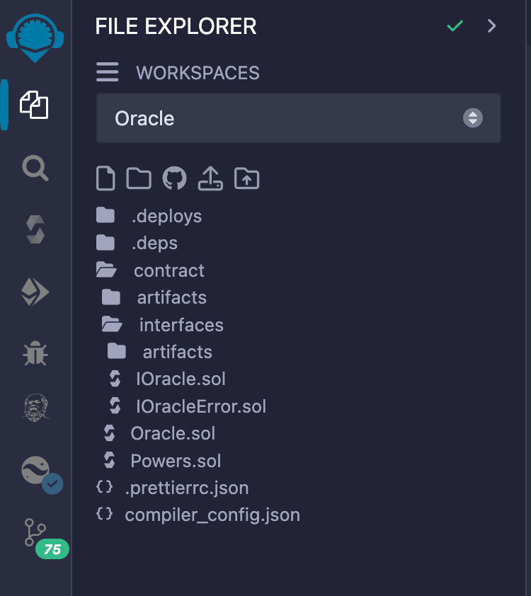
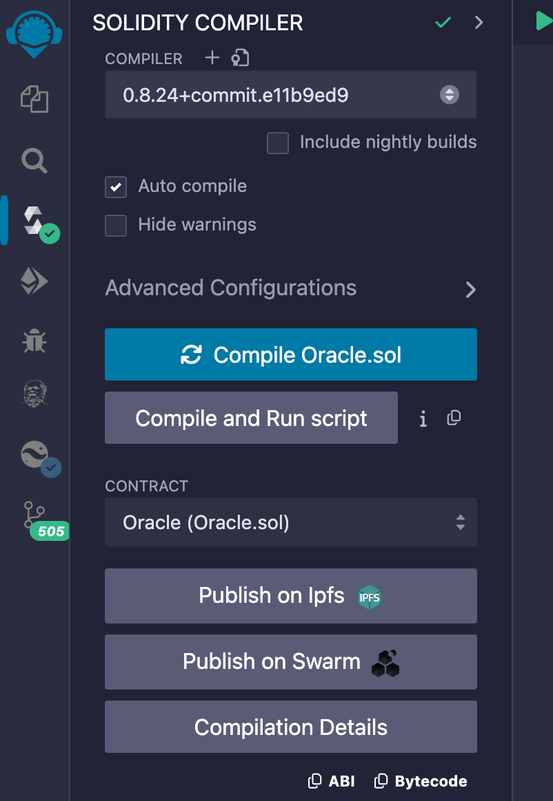
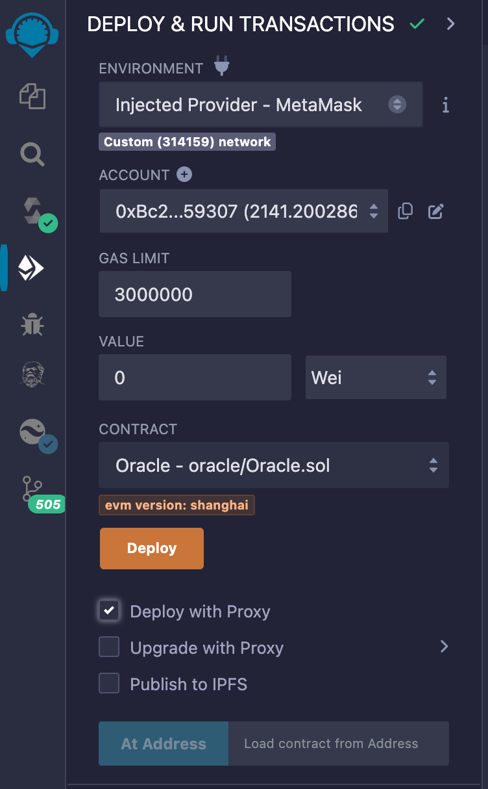
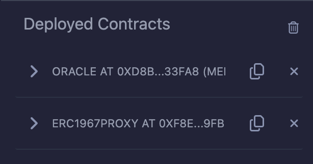
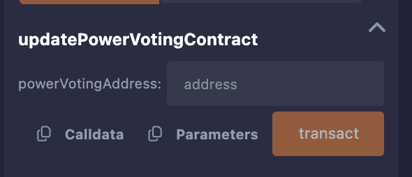
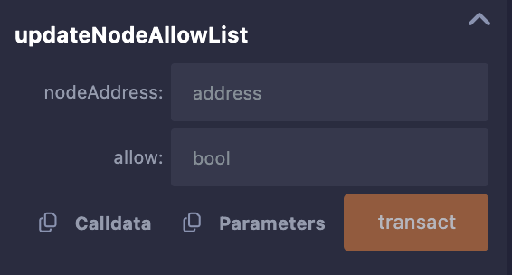

# Oracle Contract Compilation Guide

#### 1. Clone the Repository

Clone the Oracle contract repository with the branch set to main:

```
git clone https://github.com/filecoin-project/on-chain-voting.git
```

#### 2. Navigate to the Contract Directory

Enter the contract directory within the cloned repository:

```
cd power-oracle-contracts
```

#### 3. Open Remix

Go to [Remix](https://remix.ethereum.org/) to work with the contracts:



#### 4. Upload and Compile the Oracle Contract

Copy the contract files from your local directory to Remix. Open the `Oracle.sol` file in Remix and compile it:



#### 5. Connect MetaMask to Remix

Ensure MetaMask is connected to Remix and switch to the Filecoin network.

#### 6. Deploy the Contract with Proxy

In Remix, check the 'Deploy with Proxy' option and click the 'Deploy' button. This will deploy two contracts:

- `ORACLE`: the logic contract
- `ERC1967PROXY`: the proxy contract



After deployment, you should see two contracts deployed:



#### 7. Update the Power Voting Contract

Open the `ERC1967PROXY` contract, call the `updatePowerVotingContract` method, and pass the address of the deployed `PowerVoting` contract:



#### 8. Update the Oracle Node Whitelist

Call the `updateNodeAllowList` method on the `ERC1967PROXY` contract. Pass the address used by the Oracle Node and set the value to `true` to update the Oracle Node whitelist:



By following these steps, you will successfully compile, deploy, and configure the Oracle contract using Remix and MetaMask on the Filecoin network.
