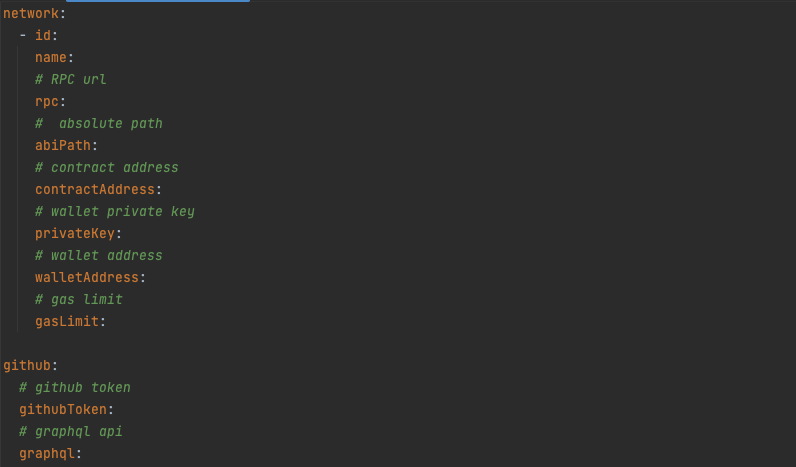
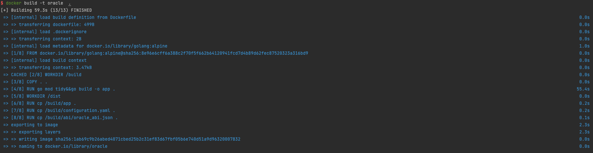
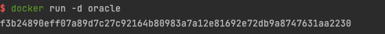
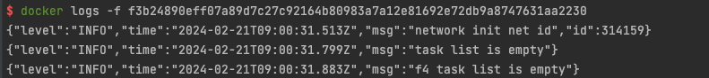

# Oracle Node Compilation Guide

#### 1. Install Go Toolchain

First, you need to install the Go toolchain. You can find [installation instructions](https://go.dev/doc/install) here. Ensure that you install Go version >= 1.20.

#### 2. Install Docker

Next, install Docker by following the instructions for your operating system [here](https://docs.docker.com/engine/install/).

#### 3. Clone the Oracle Node Repository

Clone the Oracle node repository and navigate to the backend directory:

```
https://github.com/filecoin-project/on-chain-voting.git
cd power-oracle-node/backend
```

#### 4. Modify the Configuration File

Edit the `configuration.yaml` file as needed for your environment.



#### 5. Build the Docker Image

Build the Docker image for the Oracle node:

```
docker build -t oracle .
```



#### 6. Run the Docker Image

Run the Docker image in detached mode:

```
docker run -d oracle
```



#### 7. View Logs

To monitor the logs of the running container, use the following command, replacing the container ID with the ID of your running container:

```
docker logs -f <container_id>
```

For example:

```
docker logs -f f3b24890eff07a89d7c27c92164b80983a7a12e81692e72db9a8747631aa2230
```



By following these steps, you will successfully compile, build, and run the Oracle node using Docker.
