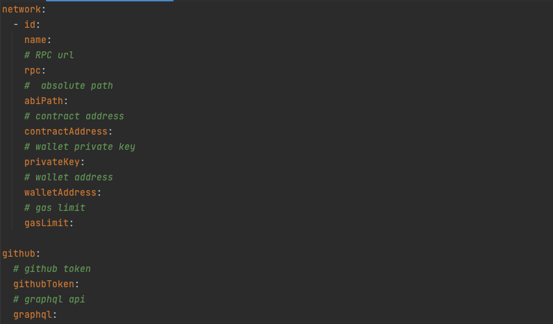

# Oracle Node

The Oracle node is an integral part of decentralized networks, providing external data to smart contracts on the blockchain. It serves as a bridge between off-chain data sources and on-chain smart contracts, enabling smart contracts to execute based on real-world events and information.

## Overview

The responsibilities of an Oracle node include:

- Retrieving data from external sources
- Verifying the authenticity and integrity of data
- Transmitting data to the blockchain
- Triggering smart contract execution based on predefined conditions

## Features

- **Data Retrieval:** Oracle nodes fetch data from various off-chain sources such as APIs, databases, and other external systems.
- **Data Verification:** They use encryption techniques and consensus mechanisms to verify the authenticity and integrity of the retrieved data.
- **Data Transmission:** Once verified, Oracle nodes transmit the data to the blockchain, making it available for smart contract consumption.
- **Smart Contract Interaction:** They interact with smart contracts on the blockchain, triggering their execution based on predefined conditions or events.

## Deployment

For deployment instructions, please refer to this document: [Deployment Guide](Install.md)

## Usage

Once the Oracle node is up and running, it continuously fetches data from specified sources, verifies the data, and transmits it to the blockchain. Smart contracts can then access this data and execute based on predefined conditions.

1. **Configure `configuration.yaml`**: 

   Edit the `configuration.yaml` file according to your environment settings.

   

2. **Run Tests**:

   ```
   cd /on-chain-voting/power-oracle-node/backend
   go test ./...
   ```

## Author

The Oracle Node is developed by StorSwift Inc.
