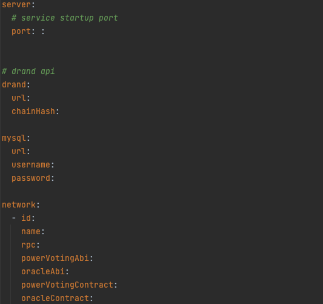
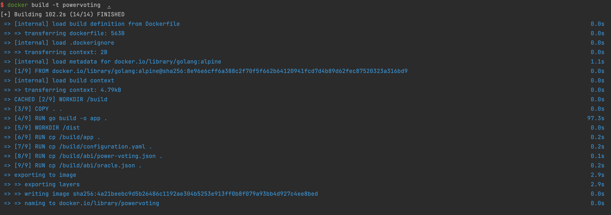
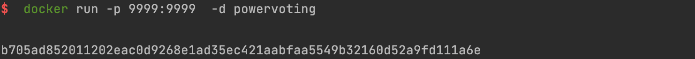
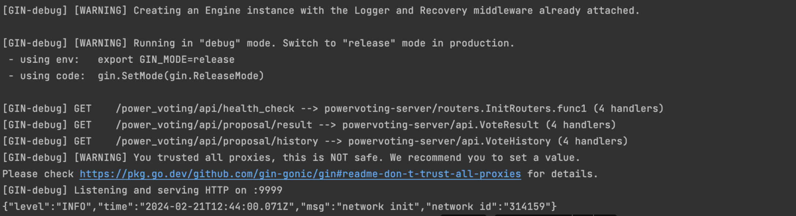

# I.Compilation of the PowerVoting backend


## 1.First, you need to install the Go toolchain. You can find [instructions](https://go.dev/doc/install) here, with Go version >= 1.20


## 2.Install [Docker](https://docs.docker.com/engine/install/ubuntu/)


## 3.Install MySQL server [Docker](https://hub.docker.com/r/mysql/mysql-server) image


## 4.Obtain the PowerVoting backend code, with the repository branch set to: dev-filecoin

```bash
git clone https://github.com/black-domain/powervoting-backend.git
```


## 5.Modify the configuration.yaml configuration file




## 6.Install dependencies

```bash
go mod tidy
```


## 7.Build Docker image

```bash
docker build -t powervoting  .
```




## 8.Run Docker image

```bash
docker run -p 9999:9999  -d powervoting
```




## 9.View logs


