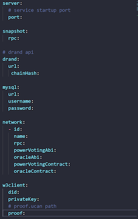
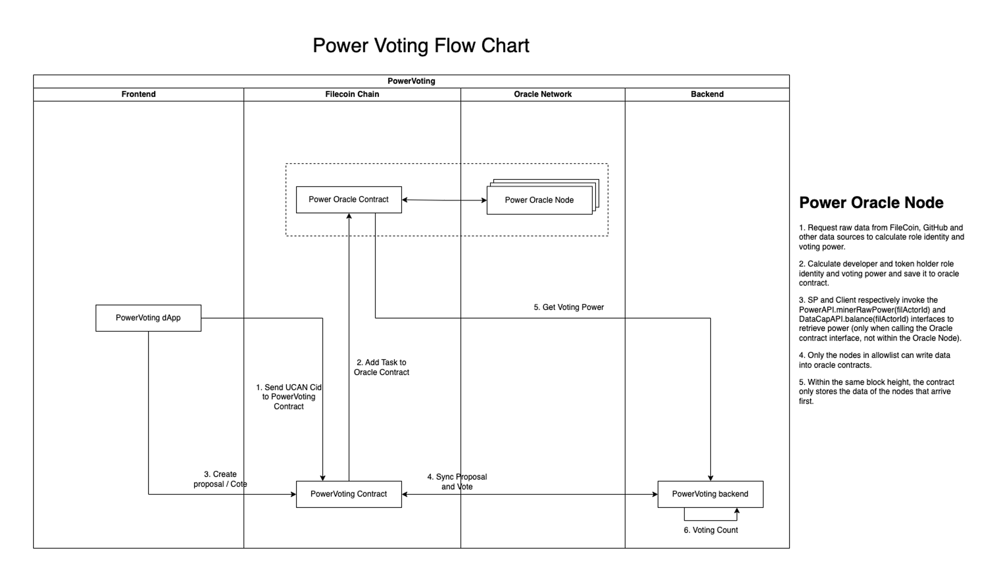
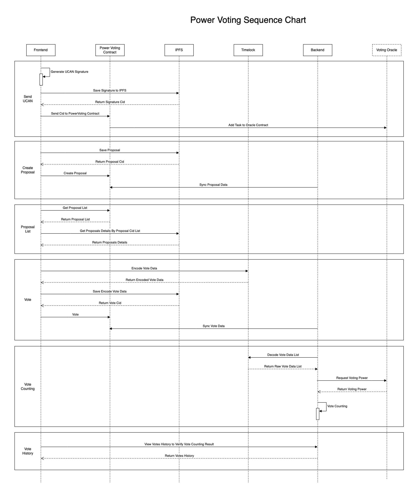
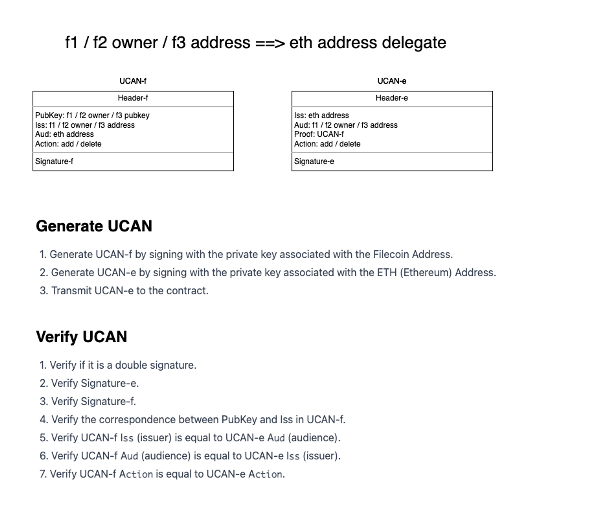
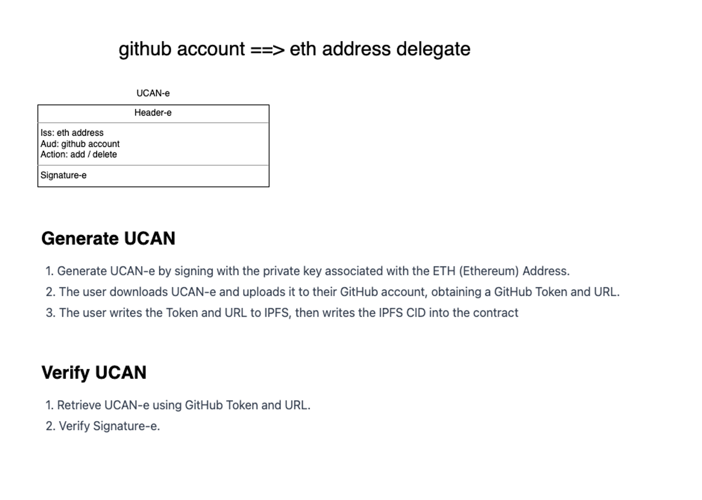

# StorSwift Power Voting

## Overview

Power Voting dApp utilizes timelock based on smart contract technology to achieve fair and private voting. Before the voting deadline, no one’s voting results will be seen by others, and the voting process will not be disturbed by other participant’s voting results. After the voting deadline, anyone can count the votes in a decentralized manner, and the results of the counting will executed and stored by smart contract and will not be manipulated by any centralized organization or individual. 

Power Voting dApp aims to become the infrastructure of DAO governance.

## Deployment

For deployment instructions, please refer to the [Deployment Guide](Install.md).

## Usage

1. **Configure `configuration.yaml`**: 

   Edit the `configuration.yaml` file according to your environment settings.

   

2. **Run Tests**:

   ```
   cd /on-chain-voting/powervoting-backend
   go test ./...
   ```

## Problem

In the community voting process governed by DAO, since the voting data of other community members can be seen before the vote counting time, the community members will be affected by the existing voting data before voting, and some members will even take advantage of a large number of voting rights in their hands to vote at the end of the voting process to make the voting results are reversed, resulting in unfair voting.

In the centralized voting process, since the vote counting power is in the hands of the centralized organization, it will cause problems such as vote fraud and black box operation of vote counting, resulting in the voting results being manipulated by others, which cannot truly reflect the wishes of the community.

## Solution

Power Voting dApp stores voting information on the blockchain, and all voting operations are executed on the chain, which is open and transparent. 

When community members vote, they use the timelock technology to lock the voting content, and voting content cannot be viewed until the voting expiration time reaches, so that no one can know the voting information of other members before voting expiration time reaches. 

After the counting time arrives, any voting participant can initiate a vote count without being affected by any centralized organization.

## Timelock

When creating a proposal, the creator will enter a voting expiration time, and Power Voting dApp will store the proposal content and voting expiration time together on the blockchain. When user votes on a proposal, Power Voting dApp will call Drand Timelock API to encrypt user's voting data and store the encrypt data into contract, the encrypt data won't be decrypt until the proposal expiration time. When proposal expiration time reached, Power Voting dApp will call Drand Timelock API to decrypt user's voting data to count the proposal. Power Voting dApp will lock all users' voting content and not allow anyone to query voting content until voting expiration time, to make sure no one can know the voting information of other members before voting expiration time reaches.

## Voting Power Snapshot

Power Snapshot requests raw data from data sources such as FileCoin and GitHub, calculates role identities and voting weights, and saves them to the Power Snapshot service. SP and Client call the RPCs of `Filecoin.StateMinerPower` and `Filecoin.StateMarketBalance` to obtain weights respectively. The Power Snapshot service saves 60 days of voting weight history. When users vote, only the percentage is recorded, not the actual voting weight. During the counting process, a weight is randomly selected from the 60-day historical record and multiplied by the percentage to calculate the number of votes.

## Power Voting Flowchart



## Power Voting Sequence Chart



## UCAN Design





## Author

The PowerVoting Backend is developed by StorSwift Inc.

