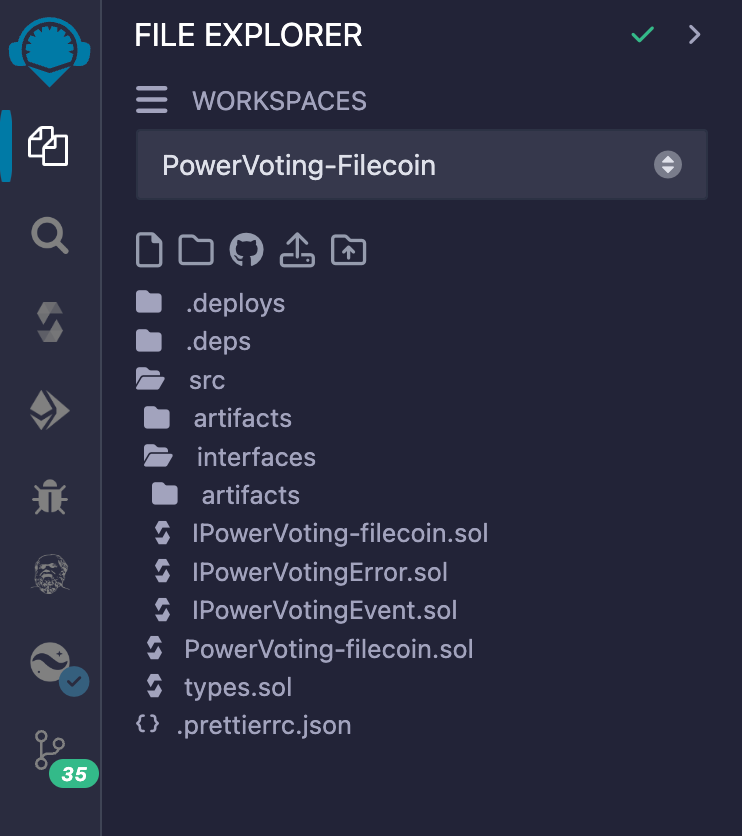
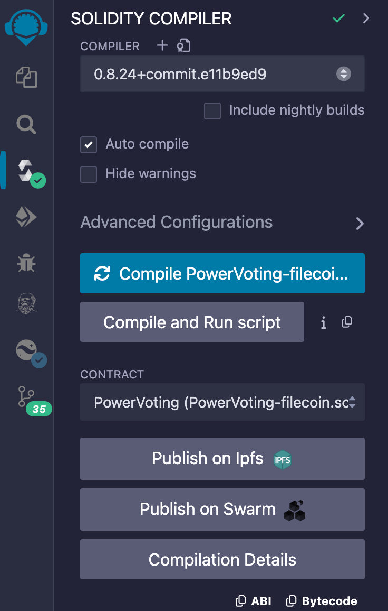
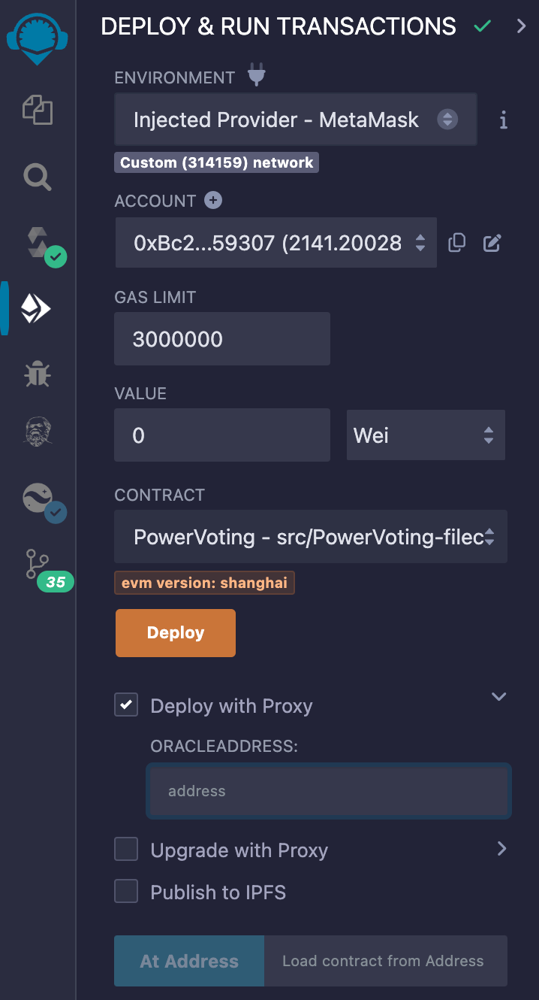
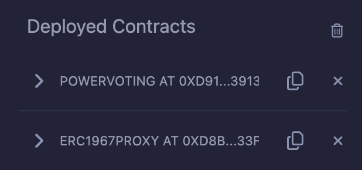

# Compilation of the PowerVoting Contract

#### 1. Clone the PowerVoting Contracts Repository

First, clone the repository with the branch set to `main `:

```
git clone https://github.com/filecoin-project/on-chain-voting.git
```

#### 2. Enter the Contract Directory

Navigate to the contract directory:

```
cd powervoting-contracts
```

#### 3. Copy the Code to Remix

Open [Remix](https://remix.ethereum.org/) in your browser and copy the code into it.



#### 4. Compile the PowerVoting-filecoin.sol File

In Remix, open the `PowerVoting-filecoin.sol` file and compile it.



#### 5. Connect to MetaMask and Switch to the Filecoin Network

Make sure you are connected to MetaMask and have switched to the Filecoin network.

#### 6. Deploy the Contract

- Check 'Deploy with Proxy'.
- Enter the address of the Oracle contract.
- Click the 'Deploy' button.



#### 7. Post-Deployment

After deployment, there will be two contracts:

- `POWERVOTING` (the logic contract)
- `ERC1967PROXY` (the proxy contract).

