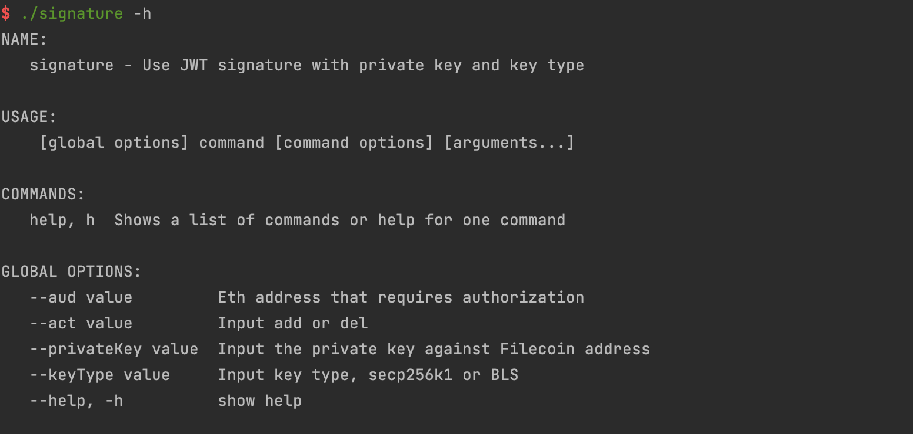

# Compiling the UCAN Tool

#### 1. Install the Go Toolchain

First, you need to install the Go toolchain. You can find [installation instructions](https://go.dev/doc/install) here. Ensure you install Go version >= 1.20.

#### 2. Clone the UCAN Signature Tool Repository

Obtain the code for the UCAN signature tool:

```
git clone https://github.com/filecoin-project/on-chain-voting.git
```

#### 3. Install Dependencies

Navigate to the `ucan-utils` directory and install the dependencies:

```
cd ucan-utils
go mod tidy
```

#### 4. Build the Binary File

Build the binary file using the following command:

```
go build -o signature .
```

#### 5. Run the Signature Tool

Now you should be able to run the signature tool:

```
./signature -h
```

This command will display the help menu for the signature tool.



Following these steps, you will have successfully compiled and run the UCAN tool.
